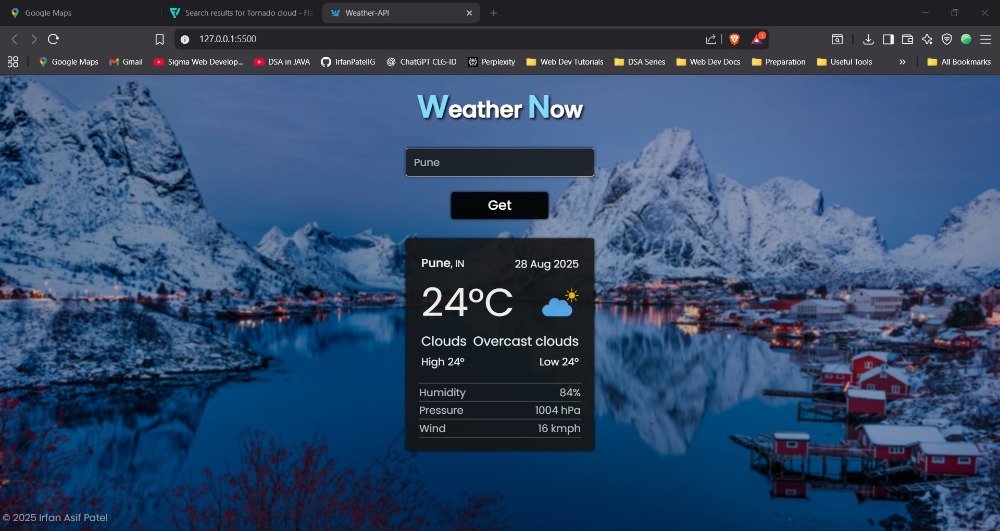

# 🌦️ Weather-Now  

**Real-Time Weather Checker App** – Built with **HTML, CSS, and JavaScript**, integrating a weather API to fetch and display live weather updates.  

## 🚀 Features  
- Fetches live weather data using a public Weather API  
- Search weather by city name  
- Displays temperature, humidity, and conditions in real-time  
- Fully responsive UI for mobile, tablet, and desktop  

## 🛠️ Tech Stack  
- **HTML5**  
- **CSS3**  
- **JavaScript (ES6+)**  
- **Weather API**  

## 📸 Screenshots  
### 🌦️ Main Desktop View  
  
  

### 🌦️ Mobile View  
  

### ⚠️ Error Handling  
  
  


## 📂 Installation & Usage  
1. Clone the repository:  
   ```bash
   git clone https://github.com/yourusername/weather-now.git
